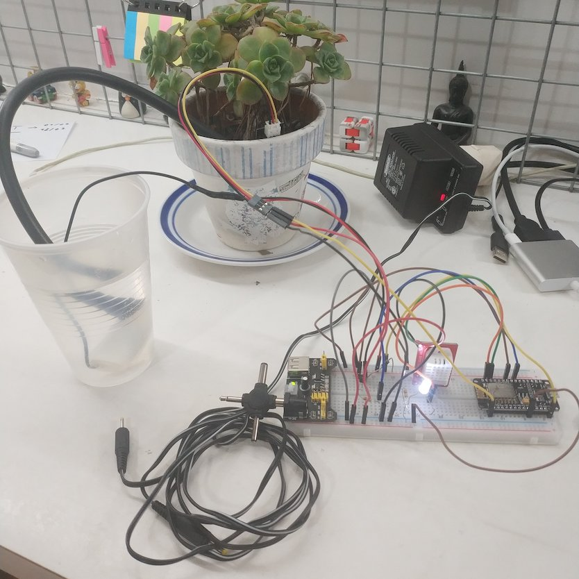

# TP Teoría de Control - UTN - FRBA

Sistema de Control de Riego.

## Integrantes

Nombre | Legajo | Mail |
:---: | :---: | :---: |
Hernán Domingo | 1306315 | hdomingo@est.frba.utn.edu.ar |
Nahuel Oyhanarte | 1545668 | noyhanarte@est.frba.utn.edu.ar |
De Luca Rodrigo | 1398143 | cdelucagallego@est.frba.utn.edu.ar | 
Constenla Juan Manuel | 1204415 | juanconstenla@est.frba.utn.edu.ar | 

## Objetivo

El presente trabajo busca realizar un análisis detallado del funcionamiento de un sistema de control de riego, para el manejo automático del agua en una planta dentro en un entorno doméstico. A partir de la medición y análisis de dos variables principales, la temperatura ambiente y la humedad en tierra, se controla una bomba de riego que permite mantener la humedad dentro de los umbrales deseados, aumentando así la eficiencia del sistema y disminuyendo el estrés hídrico de la planta.

El foco estará puesto en un sistema doméstico, de pequeña escala, que permita controlar el riego en una maceta; aunque los principios, materiales y tecnología aquí presentados permiten extrapolar el sistema a uno de mayores dimensiones (huerta urbana, vivero, granja, etc.) sin diferencias significativas.

La variable que se controlará es la humedad de la maceta teniendo también en cuenta la temperatura ambiente, por lo tanto las señales de entrada serán la temperatura ambiente (señal digital) y la humedad en tierra (señal analógica), esta última deberá ser convertida a una señal digital en el microcontrolador.
La realimentación será negativa y será la humedad medida en tierra. Al centrarnos en un sistema para uso doméstico no tendremos en cuenta perturbaciones que
podrían ser significativas en un ambiente de mayor escala, como podrían ser, cantidad de luz
solar a la que está expuesta la plantación, el radio de dispersión del agua regada, corrientes de
aire circulantes, etc.

## Circuito

## Componentes

Se armó una implementación piloto utilizando los siguientes componentes:

* Sensor de temperatura ambiente DHT22
* Sensor de humedad en tierra capacitivo
* Mini bomba de agua sumergible + diodo (1N4004)
* Led blanco + resistencia (10 ohm)
* Transistor (2N2222) o Mosfet  + resistencia (1k ohm)
* Protoboard + cables + alimentación

## Implementación

## Informe

## Presentación

## Código

El código desarrollado para esta prueba piloto fue escrito en Arduino IDE (lenguaje basado en C/C++) y puede encontrarse en [aquí](codigo/codigo.ino).

## Conexiones

### NodeMCU

* Pin GND NodeMCU -> pin GND de fuente
* Pin VIN NodeMCU -> pin VCC (5v) de fuente

### Sensor de temperatura

* Pin VCC (3.3v) de fuente -> pin VCC sensor de temperatura
* Pin D2 NodeMCU -> pin DATA sensor de temperatura
* Pin GND de fuente -> pin GND sensor de temperatura

### Sensor de humedad

* Pin VCC (3.3v) de fuente -> pin VCC sensor de humedad
* Pin A0 NodeMCU -> pin DATA sensor de humedad
* Pin GND de fuente -> pin GND sensor de humedad

### Led de status

* Pin D1 NodeMCU -> Ánodo (+) LED de status
* Cátodo (-) LED de status -> resistencia
* Resistencia -> Pin GND de fuente

### Transistor

* Pin D6 NodeMCU -> resistencia
* Resistencia -> pin BASE de transistor
* Pin EMISOR de transistor -> pin GND de fuente

### Bomba

* Pin VCC de bomba -> pin VCC (5v) de fuente
* Pin GND de bomba -> pin COLECTOR de transistor

### Diodo

* Cátodo (-) de diodo -> pin VCC (5v) de fuente
* Ánodo (+) de diodo -> pin COLECTOR de transistor
